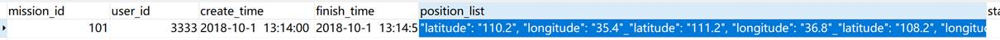
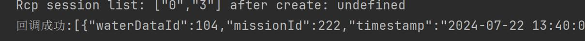

新增token

默认60分钟过期,所有的操作都需要token(登录除外),若token错误或者为空,则服务器返回空

定义token

**let** Token_AAA:string="abc";

 

修改token

**export function** setToken(Token:string){

 Token_AAA=Token

}

 

获得token(登录)

Button('登录')

 .onClick(() => { /

...

  session.post(_url.toJSON()).then((response) => {

   console.log(response.toString())

   **if** (response.toString() != **null**) {

​    console.log(response.toString())

   } 

   **let** obj = response.toJSON() **as** Json_msg;

   **if** (obj.code == 1) {

​    setToken(obj.msg)录登成功后保存服务器返回的token

​    console.log("登录成功"

///

 })

使用token(以Tget为例)

**async function** TGet(TableIndex:TABLE_,column:string,value:string):Promise<string>{

 **let** session = rcp.createSession({headers: {"Authorization": Token_AAA, }});

...

 session.get(_url).then((response) => {

   obj = response.toJSON() **as** Json_msg;

  session.close()

 }).catch((err: BusinessError) => {

  console.error(`err: err code is ${err.code}, err message is ${JSON.stringify(err)}`);

 });

 **const** result: string = **await new** Promise((resolve: Function) => {

  setTimeout(() => {

​    **try** {

因为返回可能为空,所以此时obj不能引用(这里我是用try-catch)

​    resolve(obj.code==0?"请求超时": JSON.stringify(obj.Data))

   } **catch** (e) {

​    resolve("操作失败")

   }

  }, 3000);

 });

 **return** result;

}

退出登录

**async function** LoginOut(callback:Callback<boolean>){

 **let** session = rcp.createSession({headers: {"Authorization": Token_AAA }});

 **let** _url = url.URL.parseURL(`http://${IPAddress}:${Port}/poi/login_out`);

 **let** obj:Json_msg= {

  code: 0,

  msg: '',

  Data: ''

 }

 **await** session.post(_url).then((response) => {

  **if**(response.toString()!=**null**){

   obj=response.toJSON() **as** Json_msg;

   callback(obj.code==1)

  }**else**{

   callback(**false**)

  }

 }).catch((err: BusinessError) => {

  console.error(`err: err code is ${err.code}, err message is ${JSON.stringify(err)}`);

 });

}

调用:

Button("退出登录")

 .onClick(()=>{

  LoginOut((res:boolean)=>{

   console.log(res?"登出成功":"登出失败")

  })

 })

 

 

 

 

 

Spring Boot后端测试

## 测试要求 

1>本机java1.8+

2>app权限 :

"requestPermissions": [

 {

  "name": "ohos.permission.INTERNET"

 },

 {

  "name": "ohos.permission.GET_NETWORK_INFO"

 }

],

3>下载 test.jat 

4>cmd->java -jar test.jar

## 关键实现

##### 1.   arkTs接口设计:

**interface** Json_msg {

 "code": number;

 "msg": string;

 "Data": string;

}

**export interface** User{  路由传参接口

 

 "userId":number,

 "username":string,

 "password":string,

 "devUuidList":string,

 "missionIdList":string

}

##### 2.   arkTs http-post请求,处理与路由传参:

###### 2.1关键代码

**let** session = rcp.createSession();

**let** _url = url.URL.parseURL(`http://172.19.77.100:8080/poi/login?username=${**this**.Acc}&password=${**this**.psw}`);

session.post(_url).then((response) => {

 //response为rcp.Response对象,服务器返回的内容

 **let** obj=response.toJSON() **as** Json_msg;//将其解析为Json_msg  *Json1

 console.log(response.toString());

 console.log("obj.code:"+obj.code)

 console.log("obj.msg:"+obj.msg)

 console.log("obj.Data:"+JSON.stringify(obj.Data))

 **if**(obj.code==1){

  console.log("登录成功")

  **let** temp=JSON.stringify(obj.Data,["userId","username","phoneNumber","devUuidList","missionIdList"]);

  **let** user1=JSON.parse(temp) **as** User;

  router.replaceUrl({//这里为登录成功后的页面路由,replaceUrl:替换原来的页面(原页面会被销毁)

   url:"pages/Main",

   params:user1//穿给新页面的参数

  })

 

 }**else**{

  console.log(obj.msg)

 }

}).catch((err: BusinessError) => {

 console.error(`err: err code is ${err.code}, err message is ${JSON.stringify(err)}`);

});

###### 2.1替换ipv4地址

*这里的172.19.77.100里ip地址需要换成本机(运行jar包的IP地址)

cmd-->ipconifg找到自己的ip地址填入,如:

###### 2.2 登录示例Json格式

*Json1:

登录成功

账号不存在:

密码错误:

###### 2.3 新页面接收参数

**import** { router } **from** '@kit.ArkUI';

 

@Entry

@Component

**struct** Main {

 @State user1:User= {

  userId: 0,

  username: '',

  password: '',

  devUuidList: '',

  missionIdList: ''

 };

 aboutToAppear(): void {

  **try** {

   **this**.user1=router.getParams() **as** User

  }**catch** (e){

   console.log("some err exist at aboutToAppear-MainPage")

  }

 }

 

 build() {

  RelativeContainer() {

   Column(){

​    Text("登录成功")

​    Text("账号:"+**this**.user1.userId)

​    Text("用户名:"+**this**.user1.username)

​    Text("绑定设备列表:"+**this**.user1.devUuidList)

​    Text("任务:"+**this**.user1.missionIdList)

   }

  }

  .height('100%')

  .width('100%')

 }

}

 

###### 2.4注册参数

@State **private** Acc_sign:string=''; //通过字符串保存,实际上时数字

@State **private** psw_sign:string='';

@State **private** username:string='';

@State **private** phone_number:string='';

上传数据前应先参照user_accounts表,先进行检查自己定义的合法性检查(如user_id的长度不小于6位等)

 

**let** _url = url.URL.parseURL(`http://47.96.237.24:8080/poi/sign?Acc=${**this**.Acc_sign}&psw=${**this**.psw_sign}&username=${**this**.username}&phone=${**this**.phone_number}`);

session.post(_url).then((response) => {

 //response为rcp.Response对象,服务器返回的内容

 console.log(JSON.stringify(response));

 **let** obj=response.toJSON() **as** Json_msg;//将其解析为Json_msg

 **if**(obj.code==1){

  console.log("注册成功")

 }**else**{

  console.log("注册失败")

 }

}).catch((err: BusinessError) => {

 console.error(`err: err code is ${err.code}, err message is ${JSON.stringify(err)}`);

});

###### 2.5 注册Json示例

用户名已经存在:

注册成功:

其他情况(如字段错误,或格式错误):

此时obg.code可能=null   (未验证)

 

# ArkTS-SpringBoot-MySql增删改查接口

## 1.新增记录

​     方法TADD

**let** res=TAdd(TABLE_.mission_data,"339","555","aaa")

res.then((result:boolean)=>{

 console.log(result?"插入成功":"插入失败")

})

在表mission_data中插入一条39 user_id=555 create_time=aaa的记录

TAdd()第一个参数为表名枚举TABLE_(1-5),剩下12个参数(其中后9个为默认值为"0"的可选参数),参数顺序参照表中字段顺序,传入传入String类型 后端自动解析

## 2.  删除记录

Button("TDelete").onClick(()=>{

 **let** res=TDelete(TABLE_.water_quality_data,102)

 res.then((result:boolean)=>{

  console.log(result?"成功":"失败")

 })

})

在表water_quality_data中删除id为102的记录

## 3.  修改记录

Button("TEdit").onClick((event: ClickEvent) => {

 **let** res=TEdit(TABLE_.water_quality_data,101,"organic_matter","1.66")

 res.then((result)=>{

  console.log(result?"操作成功":"操作失败")

 })

})

以上示例实现:

将表water_quality_date 中的 主键为101的记录的organic_matter的值修改为1.66

 

第一个参数:TABLE_枚举

第二个参数:想要秀改记录的ID

第三个参数:要修改的字段名

第四个参数:要修改为什么值(传入字符串格式,后端自动解析)

 

## 4.  查找记录

Button("TGet").onClick((event: ClickEvent) => {

 **let** res =TGet(TABLE_.water_quality_data,"mission_id","222")

 res.then((result:string)=>{

  **let** WaterDataList=JSON.parse(result) **as** WaterData[]

  WaterDataList.forEach((value:WaterData,index:number)=>{

   console.log(`第${index+1}个点的坐标:{经度:${value.latitude},纬度:${value.longitude}}`)

  })

 })

})

上述示例实现:

查找在表water_quality_data中的mission_id等于222的所有记录,然后将其解析为

*WaterData列表,并输出了这些记录的坐标值:

*WaterData接口定义见下文

#  

# 接口实现:

## MySqlUtil.ets

**import** { rcp } **from** '@kit.RemoteCommunicationKit';

**import** { url } **from** '@kit.ArkTS';

**import** { BusinessError } **from** '@kit.BasicServicesKit';

 

**let** IPAddress:string="172.19.77.100";

**let** Port:number=8080;

 

 

**enum** TABLE_ {

 mission_data = 1,

 navigation_dara,

 user_accounts,

 video_data,

 water_quality_data

}

 

**interface** Json_msg {

 "code": number;

 "msg": string;

 "Data": string;

}

**interface** Point{

 "latitude": string,

 "longitude": string

}

 

**interface** WaterData{

 "waterDataId": number,

 "missionId": number,

 "timestamp": string,

 "latitude": number,

 "longitude": number,

 "ph": number,

 "dissolvedOxygen": number,

 "conductivity": number,

 "turbidity": number,

 "ammoniaNitrogen": number,

 "organicMatter": number

}

**interface** Mission{

  "missionId":number;

  "userId":number;

  "createTime":string;

  "finishTime":string;

  "positionList":string;

  "status":number;

  "priority":number;//优先级

  "waterDataIdList":string;

  "navigationIdList":string;

  "description":string;

  "videoId":number;

}

 

 

 

 

 

 

 

 

 **async function** TAdd(tableIndex:TABLE_, param1:string,param2:string,param3:string,

 param4:string="0",param5:string="0",param6:string="0",

 param7:string="0",param8:string="0",param9:string="0",

 param10:string="0",param11:string="0",param12:string="0"

):Promise<boolean>{

 

  console.log("TAdd has been called")

  **let** obj:null|Json_msg=**null**;

 **let** session = rcp.createSession();

  **let** _url = url.URL.parseURL(`http://${IPAddress}:${Port}/poi/senior_add?tableindex=${tableIndex}&param1=${param1}&param2=${param2}&param3=${param3}&param4=${param4}&param5=${param5}&param6=${param6}&param7=${param7}&param8=${param8}&param9=${param9}&param10=${param10}&param11=${param11}&param12=${param12}`);

 console.log(_url.toString())

 session.post(_url).then((response) => {

  console.log(JSON.stringify(response));

  obj=response.toJSON() **as** Json_msg;//将其解析为Json_msg

 

 }).catch((err: BusinessError) => {

  console.error(`err: err code is ${err.code}, err message is ${JSON.stringify(err)}`);

 });

  **const** result: boolean = **await new** Promise((resolve: Function) => {

   setTimeout(() => {

​    resolve(obj?.code==1)

   }, 1000);

  });

  **return** result;

 

}

 

 

 

 

**async function** TDelete(table:TABLE_,id:number):Promise<boolean>{

 **let** obj:Json_msg= {

  code: 0,

  msg: '',

  Data: ''

 }

 **let** session = rcp.createSession();

 // delete

 **let** _url = url.URL.parseURL(`http://${IPAddress}:${Port}/poi/senior_delete?tableindex=${table}&id=${id}`);

 console.log(JSON.stringify(_url))

 session.delete(_url).then((response)=>{

  obj=response.toJSON() **as** Json_msg;

 }).catch((err: BusinessError) => {

  console.error(`err: err code is ${err.code}, err message is ${JSON.stringify(err)}`);

 });

 **const** result:boolean=**await new** Promise((resolve:Function)=>{

  setTimeout(()=>{

   resolve(obj.code==1)

  },1500)

 });

 **return** result;

}

 

 

 

**async function** TGet(TableIndex:TABLE_,column:string,value:string):Promise<string>{

 **let** session = rcp.createSession();

 **let** _url = url.URL.parseURL(`http://${IPAddress}:${Port}/poi/senior_get?tableindex=${TableIndex}&column=${column}&value=${value}`);

 **let** obj:Json_msg= {

  code: 0,

  msg: '',

  Data: ''

 }

 session.get(_url).then((response) => {

  obj=response.toJSON() **as** Json_msg;//将其解析为Json_msg

 }).catch((err: BusinessError) => {

  console.error(`err: err code is ${err.code}, err message is ${JSON.stringify(err)}`);

 });

 **const** result: string = **await new** Promise((resolve: Function) => {

  setTimeout(() => {

   resolve(JSON.stringify(obj.Data)==""?"请求超时":JSON.stringify(obj.Data))

  }, 3000);

 });

 **return** result;

}

 

**async function** TEdit(tableIndex:TABLE_,Id:number,column:string,value:string):Promise<boolean>{

 **let** session = rcp.createSession();

 **let** obj:Json_msg= {

  code: 0,

  msg: '',

  Data: ''

 }

 **let** _url = url.URL.parseURL(`http://${IPAddress}:${Port}/poi/senior_get?tableindex=${tableIndex}&column=${column}&value=${value}`);

 session.post(_url).then((response)=>{

  obj=response.toJSON() **as** Json_msg;

 })

**const** result:boolean=**await new** Promise((resolve:Function)=>{

 setTimeout(()=>{

  resolve(obj.code==1)

 },1500)

})

 **return false** ;

}

**export**{TGet,TAdd,TDelete,TEdit,WaterData,Point,Mission,IPAddress,Port,TABLE_}

# 修改标准

将_List中每个元素改为 用"_"号分隔:

如:

position_list字段为"latitude": "110.2", "longitude": "35.4"_"latitude": "111.2", "longitude": "36.8"_"latitude": "108.2", "longitude": "25.4"

通过以下方法可以解析为ArkTS Object:

Button("test0").onClick(()=>{

 **let** session = rcp.createSession();

 **let** _url = url.URL.parseURL(`http://${IPAddress}:${Port}/poi/senior_get?tableindex=1&column=mission_id&value=337`);

 **let** obj:Json_msg= {

  code: 0,

  msg: '',

  Data: ''

 }

 **let** mission:Mission= {

  missionId: 0,

  userId: 0,

  createTime: '',

  finishTime: '',

  positionList: '',

  status: 0,

  priority: 0,

  waterDataIdList: '',

  navigationIdList: '',

  description: '',

  videoId: 0

 }

 session.get(_url).then((response) => {

  obj=response.toJSON() **as** Json_msg;//将其解析为Json_msg

  console.log(JSON.stringify(obj.Data));

 

  **let** ms=JSON.parse(JSON.stringify(obj.Data)) **as** Mission[];

 

  **let** ListString:string='';

  ms.forEach((value:Mission)=>{

   console.log(value.missionId.toString())

   ListString=value.positionList

  })

   ListString="[{"+ListString+"}]"

  **while**(ListString.search("_")!=-1){

   ListString=ListString.replace("_","},{");

  }

  console.log("ListString:"+(ListString))

  **let** pl= JSON.parse(ListString) **as** Point[];

  pl.forEach((value:Point)=>{

   console.log(value.latitude+"  "+value.longitude)

  })

 

 }).catch((err: BusinessError) => {

  console.error(`err: err code is ${err.code}, err message is ${JSON.stringify(err)}`);

 });

})

 

上述的方法将表mission_data中主键为337的记录解析为对象ms(Mission[]),如果解析为Mission(而不是Mission[])的话会出现异常,然后将ms对象的position_list属性解析成Point[],并打印出他们:

# 回调的示例

**async function** TGet_(TableIndex:TABLE_,column:string,value:string,callback:Callback<string>){

 **let** session = rcp.createSession({headers: {"Authorization": Token_AAA }});

 **let** _url = url.URL.parseURL(`http://${IPAddress}:${Port}/poi/senior_get?tableindex=${TableIndex}&column=${column}&value=${value}`);

 **let** obj:Json_msg= {

  code: 0,

  msg: '',

  Data: ''

 }

 **await** session.get(_url).then((response) => {

  obj=response.toJSON() **as** Json_msg;//将其解析为Json_msg

  callback(JSON.stringify(obj.Data).toString())

 }).catch((err: BusinessError) => {

  console.error(`err: err code is ${err.code}, err message is ${JSON.stringify(err)}` );

 });

}

调用方法:

Button("TGet_").onClick(() => {

 TGet_(TABLE_.water_quality_data, "mission_id", "222",(str:string)=>{

  console.log("回调成功:"+str)

 })

})

 